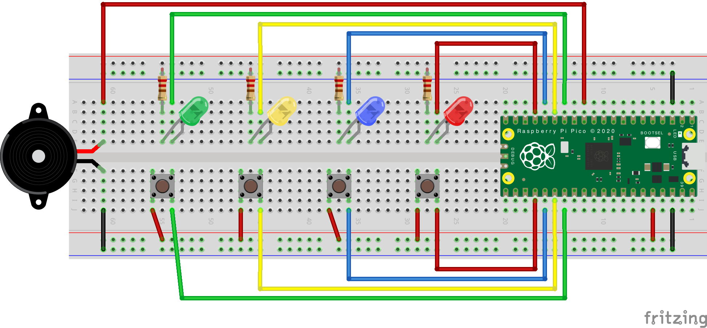

# Pico Simon

A [Simon Game](https://en.wikipedia.org/wiki/Simon_(game)) implementation
for the [Raspberry Pi Pico](https://www.raspberrypi.org/products/raspberry-pi-pico/).

## Features
- Includes 3 games:
    - The classic simon game.
    - *Catch me!*, where lights start blinking and the player need to follow
    them without falling behind (with a margin).
    - TBD.
- Settings for the games where you can choose:
    - from 3 leves of difficulty,
    - playing only with lights, only with sound or with both.

## To compile
There is a `CMakeLists.txt` file inside the `src` directory. You should also have [set up the pico C SDK](https://datasheets.raspberrypi.org/pico/getting-started-with-pico.pdf).

## Circuit

I use 220 Ohm resistors, but you can switch those according to your LEDs.

The piezo speaker goes to a different ground pin because if I used the same, it
caught some noise when using PWM to control the LEDs.

The buttons are pulled down by the pico.

This project is licensed under the terms of the MIT license.
